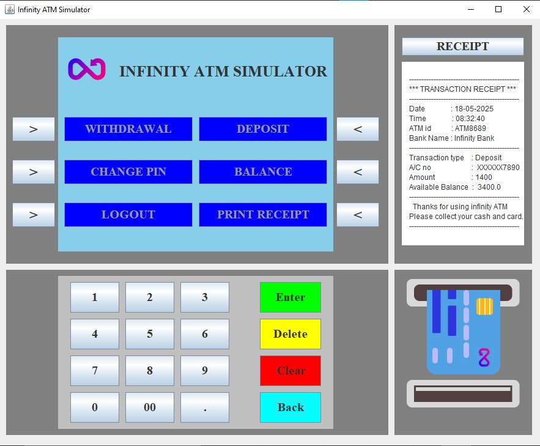
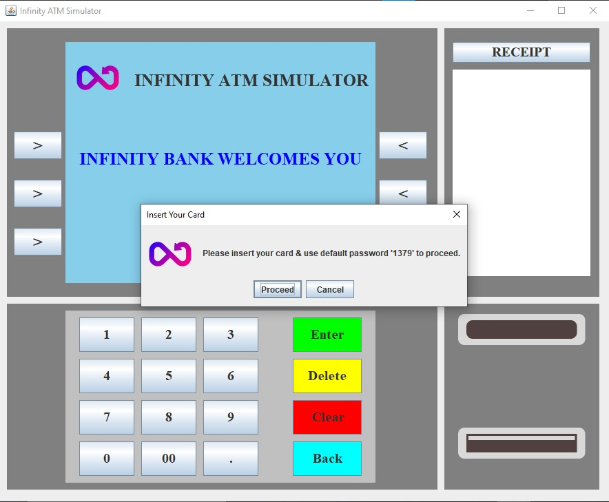

## ☕ ATM Machine Using Java Swing

- This project is a desktop-based ATM simulation system built using Java Swing. It replicates basic ATM functionalities with a user-friendly graphical interface, secure PIN-based login, and transaction features.
- All icons and UI elements were created/customized using Figma to enhance the visual appeal and user experience of the application.

## ⚙️ Features

- 🔐 Login with PIN verification
- 🔄 Change PIN securely
- 💰 Check account balance
- 💵 Deposit and withdraw money
- ⚠️ Error Detector
- 🎨 Custom icons designed in Figma

## 🛠️ Technologies Used

- Java
- Swing

## 📥 How to Clone

1. Clone this repository

```bash
git clone https://github.com/Rohan-Korake/ATM-Machine-Simulation-Using-Java-Swing-.git
```

2. To Compile

```bash
javac ATM_Machine.java
```

3. To run

```bash
java ATM_Machine
```

## 📷 Preview




## 📩 Connect with Me

- 📧 Email : rohannkorake@gmail.com
- 📂 GitHub : https://github.com/Rohan-Korake
- 🔗 Linkedin : https://www.linkedin.com/in/rohan-korake-720848342
